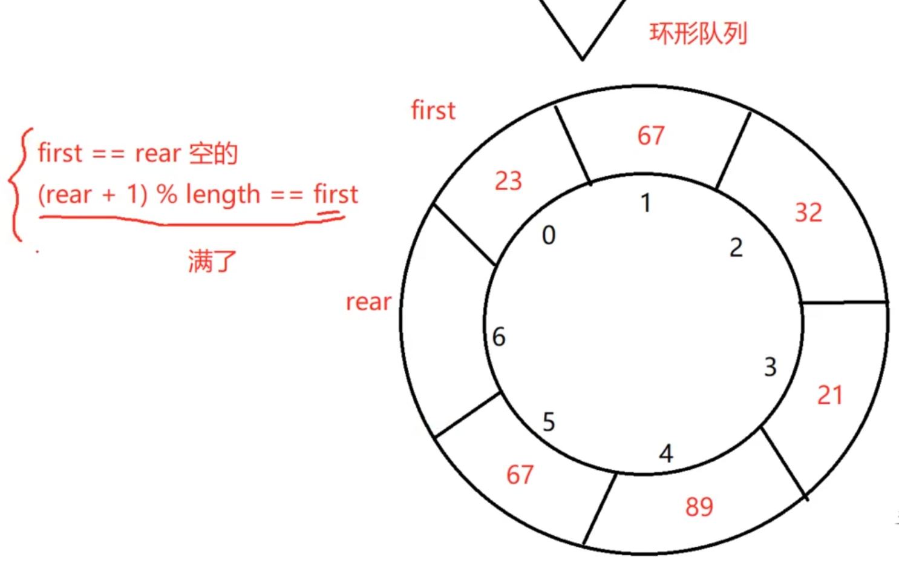

# 队列

- 数组实现 - 环形队列

``` C++
int length = 10 ;
first = rear = 0    // 初始化

// 入队
arr[rear] = val;
rear = (rear + 1) % length;    // 重点

// 出队
first = (first + 1) % length;

// 判断队列是否满了 - 默认留出一个位置判断 实际存入length-1个
if (((rear + 1) % length) == first)
{
    printf("full");    
}

```
